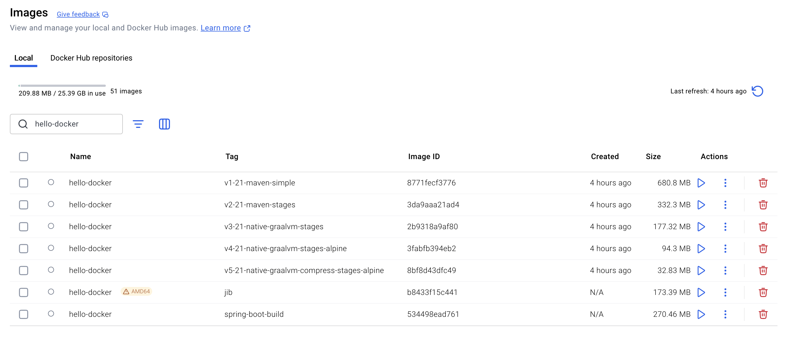

# Hello Docker

A simple Spring Boot application demonstrating various Docker containerization approaches for Java applications.

## Description

This project showcases how to containerize a Spring Boot application using different Docker strategies:
- Standard JAR-based containerization
- Multi-stage builds for optimized images
- GraalVM native image compilation for smaller footprint and faster startup

The application itself is a minimal REST API with a single endpoint:
- `GET /` - Returns the greeting message "Hello Docker 👋"

## Prerequisites

- Java 21
- Docker
- Docker Compose
- Maven 3.9+ (or use the included Maven wrapper)

## Getting Started

### Clone the Repository

```bash
git clone https://github.com/buzzcosm/hello-docker.git
cd hello-docker
```

### Build and Run Locally

```bash
./mvnw clean package
java -jar target/hello-docker.jar
```

The application will be available at http://localhost:8080

## 🐳 Docker Containerization Benchmark



## 🐳🔧 Dockerfile commands

* FROM initializes the build stage and defines the base image to build on.
* WORKDIR sets the working directory for any RUN, CMD, ENTRYPOINT, COPY, and ADD directives that follow in the Dockerfile.
* COPY copies new files or directories into the Docker image.
* RUN executes commands on top of the current image as a new layer and commits the results.
* EXPOSE configures Docker to open a specific network port for listening on the container, in this case port 8080.
* ENV sets environment variables.
* CMD provides the default execution command when the container is run.

## 🧪 Automated Build & Test Scripts

**s.** *directory*: `scripts/build_and_test_image_v*.sh`

This script will:
- Check if Docker is running
- Automatically build the image
- Start the container using docker-compose.yml
- Test the HTTP response for the string Hello Docker
- Print the result
- Stop and remove the container afterward

## 🧩(optional) Java containers with Jib

- [Building Java containers with Jib](https://cloud.google.com/java/getting-started/jib)

Helper - Get Digest if image:

> `docker inspect <image>:<tag> --format='{{index .RepoDigests 0}}'`

### Build Docker Image

```shell
./mvnw clean compile jib:dockerBuild
```

### Test

```shell
docker run --platform linux/amd64 -it --rm -p 8080:8080 --name hello-docker-jib hello-docker:jib  
```

## 🧩(optional) Spring-Boot Container

- [Packaging OCI Images](https://docs.spring.io/spring-boot/maven-plugin/build-image.html)

```shell
./mvnw spring-boot:build-image -Dspring-boot.build-image.imageName=hello-docker:spring-boot-build
```